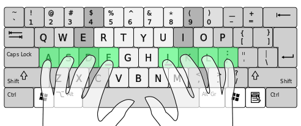

# Aprendiendo un poco de Vim y Neovim
## Ollin Langle <ollin.demian@gmail.com>

# ¿Qué es Vim?
### Es un editor de texto, tal cual, plano y sencillo.

Pero si de esos hay miles... ¿por qué usarlo?
Está disponible en todas las plataformas y en todos lados.
Aunque lo mejor es...

# MODOS
Tenemos 4 modos principales con los cuales interactuamos con nuestros archivos.
* INSERT mode - Escribimos
* NORMAL mode - Basicamente sirve para movernos y modificar sin escribir
* VISUAL mode - Seleccionar
* COMMAND mode - Ejecutar comandos

## Abriendo Vim
Sólo necesitamos teclear ```vim``` en nuestra terminal o ```vim <archivo>```
Si ya estamos adentro de _vim_ y queremos editar un archivo, en COMMAND mode:
```:edit <archivo>```

Una vez que tenemos vim encendido, entraremos automaticamente a NORMAL mode. Para
ejecutar un comando (entrar a COMMAND mode, debemos escribir ```:```)
Para regresar a NORMAL mode sólo necesitamos oprimir ```<ESC>```

## INSERT mode
El modo más común de todos es INSERT, pues es a lo que estamos acustumbrados. Es simplemente
escribir caracteres bajo un cursor. Pero para entrar a este modo tenemos diferentes opciones
según lo que más nos convenga. Desde NORMAL mode las siguientes teclas te permiten entrar a INSERT
en un lugar específico.
* i (insert)    - Bajo el cursor
* I             - Al inicio de la línea
* a (append)    - En el caracter siguiente al cursor
* A             - Al final de la línea
* o             - En la línea bajo el cursor
* O             - En la línea sobre el cursor

## Normal mode

### Movimientos

```
        k
        ^
    h <   > l
        v
        j
```
¿Por qué h, j, k, l? Bill Joy, el creador de Vi usaba una compu que tenía esas teclas como
cursor por lo que lo natural es que él las implementara de la misma manera.


Además es importante mantenernos en el home row para ser más eficientes

Entonces todos los movimientos los vamos a realizar con la mano derecha.

Pero tengo mouse y trackpad... ¿Por qué no mejor lo uso?


## Más movimientos súper útiles

* w (word) - Se mueve al inicio de la siguiente palabra
* W (Word) - Se mueve al inicio de la siguiente "Palabra" (primer caracter después de un espacio)
* b (back) - Se mueve al inicio de la palabra anterior (o en la que estamos si no es el primer caracter)
* B (Back) - Se mueve al inicio de la primera "Palabra" antes de un espacio vacio
* e (end)  - Se mueve al final de la siguiente palabra (o en la que estamos si no es el último caracter)
* E (End)  - Se mueve al final de la siguiente "Palabra"

Usar la lista anterior para probar el modo VISUAL BLOCK.

## Movimientos un poco más avanzados pero igual de útiles

* f<algo> (forward) - Busca la primera aparición de <algo> y pone el cursor sobre dicho caracter
* F<algo> (backward) - Busca la aparición hacia atrás
* t<algo> ('til) - Igual que find pero pone el curson un espacio antes del caracter
* T<algo> ('til backward) - Igual que F pero pone el cursor después de la aparición
* ( - Recorre oraciones hacia atrás (Terminaciones con puntos)
* ) - Recorre oraciones hacia adelante
* { - Recorre párrafos hacia atrás
* } - Recorre párrafos hacia adelante
* gg - Va hasta el inicio del documento
* G - Va hasta el final del documento

## Búsquedas

* / - Búsqueda hacia adelante
* ? - Búsqueda hacia atrás
* * - Búsqueda de la palabra sobre el cursor hacia adelante
* # - Búsqueda de la palabra sobre el cursor hacia atrás
* n - Siguiente resultado de una búsqueda
* N - Siguiente resultado de una búsqueda, hacia atrás

## Copiar y pegar

* y (yank) - Copiar, necesitamos decirle qué copiar (0,$,w,b,...)
* p (paste) - Pegar después del cursor
* P - Pegar antes del cursor

##
