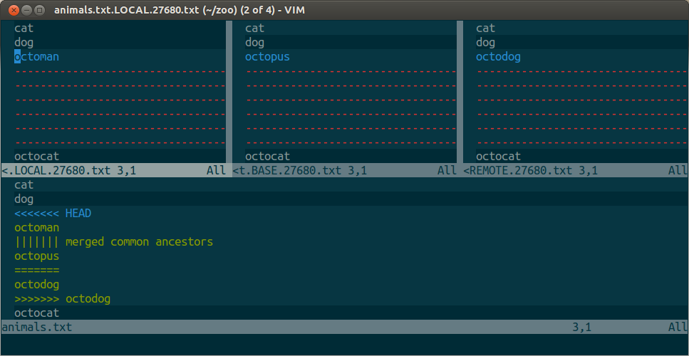

# Aprendiendo un poco de Vim y Neovim
## Ollin Langle <ollin.demian@gmail.com>

# ¿Qué es Vim?
### Es un editor de texto, tal cual, plano y sencillo.

Pero si de esos hay miles... ¿por qué usarlo?
Está disponible en todas las plataformas y en todos lados.
Aunque lo mejor es...

# MODOS
Tenemos 4 modos principales con los cuales interactuamos con nuestros archivos.
* INSERT mode - Escribimos
* NORMAL mode - Basicamente sirve para movernos y modificar sin escribir
* VISUAL mode - Seleccionar
* COMMAND mode - Ejecutar comandos

# Instalación (de neovim)

## Para Mac
```
brew install neovim
```
## Para Ubuntu
```
sudo apt-get install software-properties-common
sudo add-apt-repository ppa:neovim-ppa/stable
sudo apt-get update
sudo apt-get install neovim
```
### de Vim a Neovim
Hay que crear el archivo ```init.vim``` de esta manera
```
mkdir -p ~/.config/nvim
echo "set runtimepath^=~/.vim runtimepath+=~/.vim/after
let &packpath = &runtimepath
source ~/.vimrc" > ~/.config/nvim/init.vim
```

## Abriendo Vim
Sólo necesitamos teclear ```vim``` en nuestra terminal o ```vim <archivo>```
Si ya estamos adentro de _vim_ y queremos editar un archivo, en COMMAND mode:
```:edit <archivo>```

Una vez que tenemos vim encendido, entraremos automaticamente a NORMAL mode. Para
ejecutar un comando (entrar a COMMAND mode, debemos escribir ```:```)
Para regresar a NORMAL mode sólo necesitamos oprimir ```<ESC>```

## INSERT mode
El modo más común de todos es INSERT, pues es a lo que estamos acustumbrados. Es simplemente
escribir caracteres bajo un cursor. Pero para entrar a este modo tenemos diferentes opciones
según lo que más nos convenga. Desde NORMAL mode las siguientes teclas te permiten entrar a INSERT
en un lugar específico.
* i (insert)    - Bajo el cursor
* I             - Al inicio de la línea
* a (append)    - En el caracter siguiente al cursor
* A             - Al final de la línea
* o             - En la línea bajo el cursor
* O             - En la línea sobre el cursor

## Normal mode

### Movimientos

```
        k
        ^
    h <   > l
        v
        j
```
¿Por qué h, j, k, l? Bill Joy, el creador de Vi usaba una compu que tenía esas teclas como
cursor por lo que lo natural es que él las implementara de la misma manera.


Además es importante mantenernos en el home row para ser más eficientes


Entonces todos los movimientos los vamos a realizar con la mano derecha.

Pero tengo mouse y trackpad... ¿Por qué no mejor lo uso?


## Más movimientos súper útiles

* w (word) - Se mueve al inicio de la siguiente palabra
* W (Word) - Se mueve al inicio de la siguiente "Palabra" (primer caracter después de un espacio)
* b (back) - Se mueve al inicio de la palabra anterior (o en la que estamos si no es el primer caracter)
* B (Back) - Se mueve al inicio de la primera "Palabra" antes de un espacio vacio
* e (end)  - Se mueve al final de la siguiente palabra (o en la que estamos si no es el último caracter)
* E (End)  - Se mueve al final de la siguiente "Palabra"

Usar la lista anterior para probar el modo VISUAL BLOCK.

## Movimientos un poco más avanzados pero igual de útiles

* f<caracter> (find) - Busca la primera aparición de <caracter> y pone el cursor sobre dicho caracter
* F<caracter> (find) - Busca la aparición hacia atrás
* t<caracter> ('til) - Igual que find pero pone el curson un espacio antes del caracter
* T<caracter> ('til backward) - Igual que F pero pone el cursor después de la aparición
* ( - Recorre oraciones hacia atrás (Terminaciones con puntos)
* ) - Recorre oraciones hacia adelante
* { - Recorre párrafos hacia atrás
* } - Recorre párrafos hacia adelante
* [[ - Va hacia una sección previa (dependiendo del tipo de archivo)
* ]] - Va hacia una sección posterior
* gg - Va hasta el inicio del documento
* G - Va hasta el final del documento
* <número>gg o <número>G - salta hacia la línea dada en <número>
* % - Si estamos parados en un paréntesis-like nos lleva a su complemento
extra: <CTRL>o nos regresa al lugar previo donde nos encontrábamos
¿Qué pasa si ejecutamos gg=G?

## Búsquedas

* / - Búsqueda hacia adelante
* ? - Búsqueda hacia atrás
* \* - Búsqueda de la palabra sobre el cursor hacia adelante
* \# - Búsqueda de la palabra sobre el cursor hacia atrás
* n - Siguiente resultado de una búsqueda
* N - Siguiente resultado de una búsqueda, hacia atrás

## Copiar y pegar

* y (yank) - Copiar, necesitamos decirle qué copiar (0,$,w,b,...)
* p (paste) - Pegar después del cursor
* P - Pegar antes del cursor

## Argumento/Verbo/Sustantivo

Los comandos de edición usualmente siguen la estructura
[numero]<verbo><sustantivo>

### Ejemplo
3gUe - hacer mayúsculas las siguientes 3 palabras
3 gU e
|  | `e final de la siguiente palabra
|  `  cambiar a mayúsculas
`  3

# Comandos de edición
* d (delete) - Borrar
   ** dd - Toda la línea donde nos encontramos
   ** dj - Toda la línea donde estamos y la de abajo (análogo para dk)
   ** d0 - De donde estamos al inicio de la línea
   ** d$ - De donde estamos al final de la línea
   hay que notar que todo lo borrado se guarda en el register de vim.
* c (change) - Cambiar, igual que d pero automáticamente entras en modo INSERT
    cc - Lo hace para toda la línea
La podemos ir viendo que como es común cambiar toda una línea, hay un atajo en vim para los comandos que es apretar dos veces la misma tecla, igual ```yy``` copia toda la línea
* ~ - Cambia entre mayúsculas y minúsculas del caracter actual
* gu<movimiento> - Cambia a minúsculas los caracteres bajo el movimiento indicado
* gU<movimiento> - Cambia a mayúsculas los caracteres bajo el movimiento indicado
* ci<paréntesis> (change inside) - Cambia lo que esté adentro de un paréntesis-like

# Indentar

> Me encanta Python.
>
>        Andreu, 2018

Como en este equipo nos encanta Python, pues tenemos que indentar bien. Para eso usamos < y >
Hay dos maneras de usarlo.
* En NORMAL mode << y >> nos desindenta o indenta respectivamente una vez
* En VISUAL mode [número]< o [número]>  lo hace las veces que lo requerimos en [número]

# Manejar varios archivos a la vez
Tenemos varias opciones. Depende de lo que estemos haciendo o la forma en la que nos guste trabajar que usaremos una u otra.
* Splits (divide la pantalla)
* Buffers (archivos en una sola dimension
* Tabs (medio sucio y no se usa mucho)
## Splits
Divide tu pantalla en ventanas
* sp - Divide horizontalmente
* vsp - Divide verticalmente
Para movernos entre ventanas usamos
<CTRL>w + <movimiento> (h,j,k,l)
Por lo que si queremos ir a la ventana de la izquierda haríamos <CTRL>w + h

## Buffers
Si abrimos un archivo con ```:edit``` o nerdtree o casi de la manera que sea, se abrirá un nuevo buffer, que es un ordenamiento de nuestros archivos. Sólo uno es visible.
* :ls - Muestra la lista de buffers abiertos
* :bn - Va al siguiente buffer
* :bp - Va al buffer anterior (acepta argumento numérico)
* :b <nombre> - Abre un buffer por nombre
* :b <número> - Abre un buffer por número


## Dein y vimrc
Manejadores de paquetes hay muchos pero dein es el más nuevo y con mayor desarrollo.
## Instalando dein
```
curl https://raw.githubusercontent.com/Shougo/dein.vim/master/bin/installer.sh > installer.sh
sh ./installer.sh ~/.config/nvim/bundles
```

Abrimos vim y ejecutamos
```
:call dein#install()
```
Después mi recomendación es copiar mi [vimrc](https://github.com/ollin18/dotfiles) pues ya
está bien organizado y podemos cambiar o construir a partir de ahí.

## Macros
Repetir tareas monótonas y aburridas.
Iniciamos a grabar con ```q + <caracter>```
El macro se quedará guardado en dicho caracter y lo invocaremos con ```@q <caracter>```
Hay que pensarlos muy bien porque es fácil que fallen

## Archivos CSV
Muchas veces editamos archivos CSV y poder trabajar con ellos  de manera sencilla es vital.
Para eso utilizaremos el paquete [csv.vim](https://github.com/chrisbra/csv.vim) el cual tiene
muchísimas funciones súper útiles que podemos revisar en la documentación (no lo he usado mucho
así que no pregunten :P).
Algunas de las cosas que podemos lograr y que nos serán de utilidad:
* Mantener visibles los headers
    * Headers 1
* Ordenar las columnas
    * ArrangeColumn (Necesitamos seleccionar las columnas que queremos ordenar)
* Resaltar columnas
    * HiColumn # (# es el número de columna, si no lo ponemos resalta en la que estamos)
* Buscar en la columna
    * SearchInColumn # /foo/

Para movernos entre columnas usamos H y L (nota las mayúsculas)

## maps
* :nmap - Maps en NORMAL
* :imap - INSERT
* :vmap - VISUAL
* :cmap - COMAND LINE
* :omap - Cuando necesita un operador

De la ayuda de Vim
n  Normal mode map. Defined using ':nmap' or ':nnoremap'.
i  Insert mode map. Defined using ':imap' or ':inoremap'.
v  Visual and select mode map. Defined using ':vmap' or ':vnoremap'.
x  Visual mode map. Defined using ':xmap' or ':xnoremap'.
s  Select mode map. Defined using ':smap' or ':snoremap'.
c  Command-line mode map. Defined using ':cmap' or ':cnoremap'.
o  Operator pending mode map. Defined using ':omap' or ':onoremap'.

<Space>  Normal, Visual and operator pending mode map. Defined using
         ':map' or ':noremap'.
!  Insert and command-line mode map. Defined using 'map!' or
   'noremap!'.

## Neovim
Vim es un acrónimo de Vi-improved y sí lo es, pero es un desarrollo cerrado a una sola persona y no tiene un emulador de terminal realmente funcional. Ahí es donde Neovim llega al rescate (:
Neovim es un software colaborativo y abierto, por lo que tiene mejoramientos continuos.
Podemos interactuar con la terminal con los comandos ```T```
* :Topen
* :Tclose
* :Ttoggle
* :Tclear
* :Tkill
* :T comando

*Neoterm*
Neoterm nos permite interactuar con un REPL o bash de manera asíncrona por lo que no necesitas guardar las cosas para que puedas ejecutarlas. De esta manera podemos hacer tests mediante los REPL.  Neoterm detecta el tipo de archivo por la extensión y abre automáticamente el REPL en cuestión.
* <CTRL>l - Manda la línea de nuestro archivo al REPL
* <CTRL>s - Manda una selección de visual al REPL

## Vim y Git
### fuGITive
Fugitive es un wraper plugin de GIT dentro de vim y permite un flujo ininterrumpido de trabajo y consistencia en los commit messages.

El funcionamiento básico:
* Gstatus - Abre un split con ```git status```, podemos hacer add o reset con ```-``` sobre el archivo en cuestión. Salimos con ```:q```
* Gwrite - Hace un ```git add```
* Gcommit - Abre un split con ```git commit```, donde podemos escribir el mensaje del commit. Salimos con ```:wq```, damos enter
* Gmove - Hace git move en un archivo y también cambia el nombre del buffer
* Gdelete - Hace ```git rm```
* Gread - Es como ```git checout -- <archivo>``` pero sobre el buffer por lo que no se guarda automaticamente, es decir basta un ```u``` para rehacer los cambios


Primero tenemos que configurar nuestro git para usar vimdiff como mergetool
```
git config merge.tool vimdiff
git config merge.conflictstyle diff3
git config mergetool.prompt false
```
Ahora para hacer merge de un archivo con conflictos ejecutamos
```
git mergetool archivo
```
Obtendremos algo así


Podemos ver que tenemos arriba:
* Archivo Local
* Archivo Base (antes de que ambos lo cambiaran)
* Archivo Remoto

Y abajo:
* Archivo generado por conflictos

Todo vamos a hacerlo dentro de la ventana del archivo de conflictos. Nos paramos dentro de un conflicto y decidimos qué modificaciones son las que nos queremos quedar
* diffg L - Mantenemos los cambios de Local
* diffg B - Mantenemos los cambios de Base
* diffg R - Mantenemos los cambios de Remoto

Saltar entre diffs
* ]c - Salta a siguiente diff
* [c - Salta al diff anterior

Cerramos y guardamos
